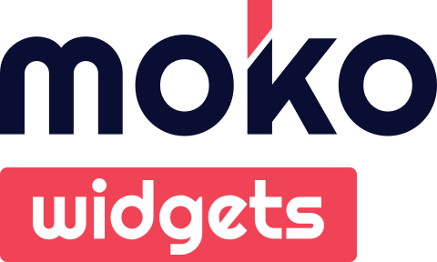

  
[](http://www.apache.org/licenses/LICENSE-2.0) [ ](https://bintray.com/icerockdev/moko/moko-units/_latestVersion) 

# Mobile Kotlin widgets
This is a Kotlin MultiPlatform library that provides UI in common code.  
**NOT RELEASED YET. WORK IN PROGRESS.**

## Table of Contents
- [Features](#features)
- [Requirements](#requirements)
- [Versions](#versions)
- [Installation](#installation)
- [Usage](#usage)
- [Samples](#samples)
- [Set Up Locally](#setup-locally)
- [Contributing](#contributing)
- [License](#license)

## Features
- **** .
TODO

## Requirements
- Gradle version 5.4.1+
- Android API 21+
- iOS version 9.0+

## Versions
- kotlin 1.3.50
  - 0.1.0
  - 0.1.1

## Installation
root build.gradle  
```groovy
allprojects {
    repositories {
        maven { url = "https://dl.bintray.com/icerockdev/moko" }
    }
}
```

project build.gradle
```groovy
dependencies {
    commonMainApi("dev.icerock.moko:widgets:0.1.0")
}
```

settings.gradle  
```groovy
enableFeaturePreview("GRADLE_METADATA")
```

On iOS, in addition to the Kotlin library add Pod in the Podfile.
```ruby
pod 'MultiPlatformLibraryWidgets', :git => 'https://github.com/icerockdev/moko-widgets.git', :tag => 'release/0.1.0'
```
**`MultiPlatformLibraryWidgets` CocoaPod requires that the framework compiled from Kotlin be named 
`MultiPlatformLibrary` and be connected as a CocoaPod `MultiPlatformLibrary`. 
[Here](sample/ios-app/Podfile)'s an example.
To simplify integration with MultiPlatformFramework you can use [mobile-multiplatform-plugin](https://github.com/icerockdev/mobile-multiplatform-gradle-plugin)**.  
`MultiPlatformLibraryWidgets` CocoaPod contains an *****.

## Usage
TODO

## Samples
Please see more examples in the [sample directory](sample).

## Set Up Locally 
- The [widgets directory](widgets) contains the `widgets` library;
- The [sample directory](sample) contains sample apps for Android and iOS; plus the mpp-library connected to the apps;
- For local testing a library use the `:widgets:publishToMavenLocal` gradle task - so that sample apps use the locally published version.

## Contributing
All development (both new features and bug fixes) is performed in the `develop` branch. This way `master` always contains the sources of the most recently released version. Please send PRs with bug fixes to the `develop` branch. Documentation fixes in the markdown files are an exception to this rule. They are updated directly in `master`.

The `develop` branch is pushed to `master` on release.

For more details on contributing please see the [contributing guide](CONTRIBUTING.md).

## License
        
    Copyright 2019 IceRock MAG Inc.
    
    Licensed under the Apache License, Version 2.0 (the "License");
    you may not use this file except in compliance with the License.
    You may obtain a copy of the License at
    
       http://www.apache.org/licenses/LICENSE-2.0
    
    Unless required by applicable law or agreed to in writing, software
    distributed under the License is distributed on an "AS IS" BASIS,
    WITHOUT WARRANTIES OR CONDITIONS OF ANY KIND, either express or implied.
    See the License for the specific language governing permissions and
    limitations under the License.
